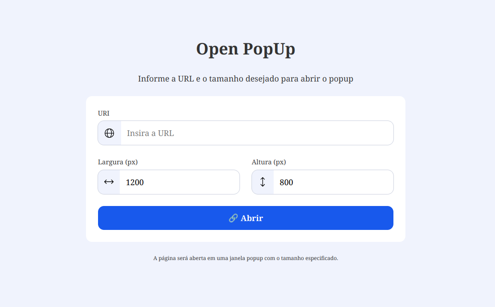

# Open popup
Open a Popup window with a url params. Used to any proposes.

## Servidor
O servidor será um CDN. O site roda apenas com HTML, CSS e JS, então não há necessidade de ter um servidor dinâmico.